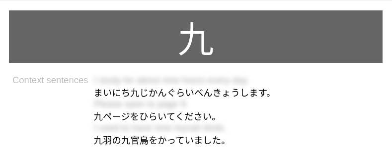

# Wantan

The <u>Wan</u>iKani <u>T</u>o <u>An</u>ki tool. This tool fetches WaniKani
content and prepares it for use in Anki.

# Dependencies

- Active WaniKani API key
- Python 3.7+ (for guaranteed insertion-ordered dicts)
- (Python3) keyring

# Usage

Managing your API key:

```sh
# Non-interactive
./wantan.py auth --store <wanikani_user_name> --key <wanikani_api_key>
# Interactive
./wantan.py auth --store <wanikani_user_name>

./wantan.py auth --dump <wanikani_user_name>
```

Fetching content:

```sh
# Get all kanji for level 1
./wantan.py fetch --out ./out --level 1 <wanikani_user_name> kanji

# Get all radicals for levels 5-10
./wantan.py fetch --out ./out --level 5-10 <wanikani_user_name> radical

# Get everything for level 20
./wantan.py fetch --out ./out --level 20 <wanikani_user_name> all

# Get everything; we recommend you print diagnostics since this takes some time.
./wantan.py fetch --log-level info --out ./out <wanikani_user_name> all
```

# Importing to Anki

When importing CSV files created by wantan, configure Anki to use a comma as a
field separator and to allow HTML in fields.

## Note Types

Use notes with the following fields to import all data for the corresponding item.

Each item features a field called `sort_field`. This member is used for sorting
in Anki. It is formatted as `<level>_(0|1|2)`, where `level` is the item's
corresponding WaniKani level, 0 indicates a radical, 1 indicates kanji, and 2
indicates vocabulary. With this schema, we can group all items of the same level
and prioritize radicals, then kanji, and then vocabulary in Anki as is done on
WaniKani. `sort_field` is not meant to be rendered in cards.

**Kanji**:

1. Characters
1. Level
1. Sort Field
1. Meanings
1. Readings Onyomi
1. Readings Kunyomi
1. Readings Nanori
1. Meaning Mnemonic
1. Meaning Hint
1. Reading Mnemonic
1. Reading Hint

**Radicals**:

1. Slug
1. Characters
1. Character SVG
1. Level
1. Sort Field
1. Meanings
1. Meaning Mnemonic

We prepare `Slug` as the first field since `Characters` can be empty for radicals.

**Vocabulary**:

1. Characters
1. Level
1. Sort Field
1. Meanings
1. Rreadings
1. Parts of Speech
1. Meaning Mnemonic
1. Reading Mnemonic
1. Context Sentences

Each English sentence in a Vocabulary item's `Context Sentences` is wrapped in
`<div class="context-sentence-en"></div>` and each Japanese sentence in a
similar `div` with class `context-sentence-jp`. This allows you to style
this content in Anki based on sentence language.

## Formatting and Styling Cards

If you render SVGs for cards which have them (ex: most Radical cards), without
additional styling, the SVGs will scale to the size of the card. Consider
constraining the size of SVGs with a custom style. Also, we download the
non-styled SVGs, so you will need to provide styling to define stroke size,
color, etc. Consider the following:

```css
svg {
  width: 100px;
  height: 100px;
  fill: none;
  stroke: #000000;
  stroke-width: 68px;
  stroke-linecap: square;
  stroke-miterlimit: 2;
}
```

If you want to hide the text characters if you render SVGs in the same card, you
can conditionally render the characters based on the SVG presence as follows:

```
{{^Character SVG}}{{Characters}}{{/Character SVG}}
```

Below is a card arrangement based on some simple HTML and CSS.

Front:



Back:


# License

MIT License; see LICENSE.
